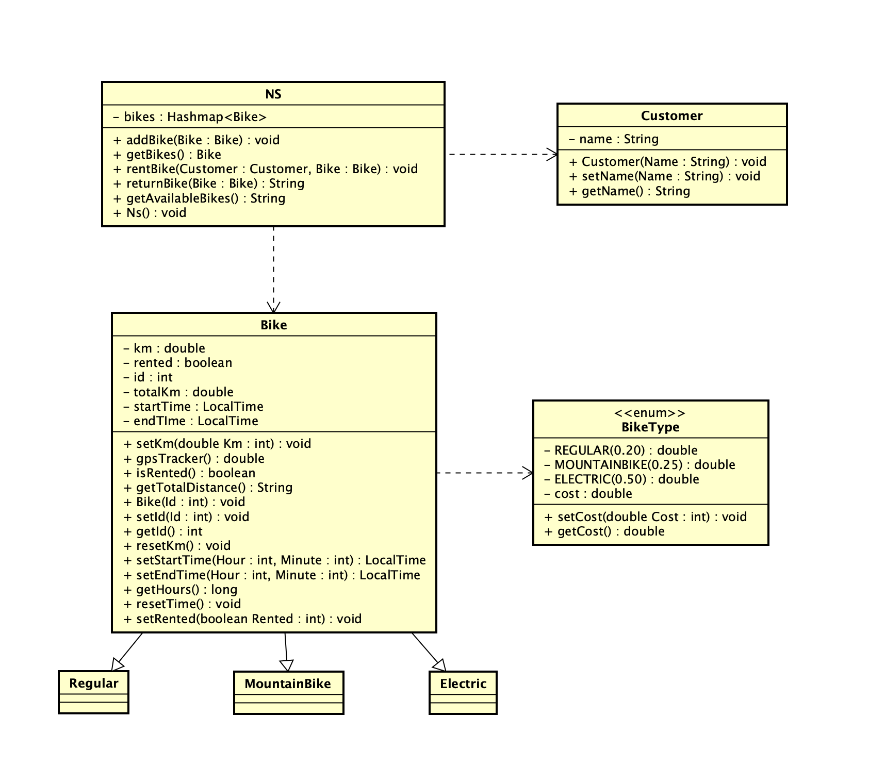

#  StartDocument for Bicycle Rental
Startdocument of **Arian Atapour**. Student number **5088453**.

## Problem Description
From Java 2 modulebook:

**6. Bicycle rental** 

   The NS Group wants new software to track the rental of their bicycles. The
   software should track how many bicycles are still available for rental. There are
   three types of bikes: a regular one, mountain bike and electrical bike. A
   customer can hire a bicycle for a certain amount of time. The end time will be
   registered when the customer returns the bike. In every bicycle is a GPStracker. The tracker tracks the distance the customer has travelled with the
   bicycle. When the customers starts renting he has to pay deposit from €20,-.
   The customer has to pay money per kilometre. This is:
   - €0,20 for a regular bike;
   - €0,25 for a mountain bike;
   - €0,50 for a electrical bike.
   
   Per hour the customer has to pay €2,-. When the customer returns the bike,
   the customer has to pay. For maintenance purposes the company wants to
   know the total distance the bike has been used.
   
### Input & Output
In this section the in- and output of the application will be described.

#### Input
In the table below all the input (that the user has to input in order to make the application work) are described.

| Case                               | Type            | Conditions   |
|------------------------------------|-----------------|--------------|
| Name of customer                   | `String`        | not empty    |
| Addition of bike to store          | `Bike`          | not empty    |
| Rental of bike                     | `Hashmap<Bike>` | not empty    |
| Setting the kilometres on the bike | `double`        | `number` > 0 |
| Setting the cost                   | `double`        | `number` > 0 |

#### Output

| Case                                                  | Type            |
|-------------------------------------------------------|-----------------|
| Bikes from the store                                  | `Hashmap<Bike>` |
| Returning the bike to the store and getting the total | `String`        |
| Bikes available in the store for rental               | `String`        |
| Name of the customer                                  | `String`        |
| Kilometres of the bike                                | `double`        |
| Total distance traveled by the bike                   | `String`        |
| Cost of the bike ride                                 | `String`         |

#### Calculations

| Case                  | Calculation                                                                                    |
|-----------------------|------------------------------------------------------------------------------------------------|
| Cost of the bike ride | The deposit of 20 euros added to the multiplication of the bike type cost and kilometres done. |  

## Class Diagram

### Test Data

In the following table you'll find all the data that is needed for testing.